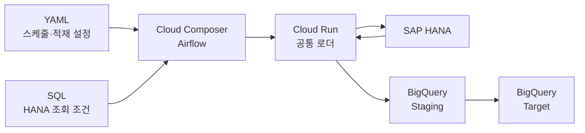
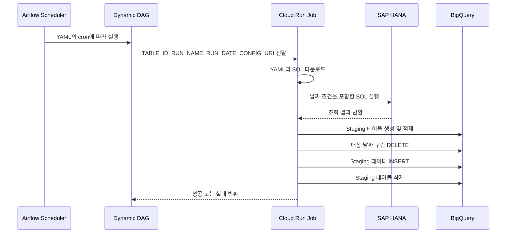

<div align="center">

# SAP HANA → BigQuery  
# Cloud Composer 기반 배치 오케스트레이션

**YAML과 SQL만 추가하면 테이블별 Airflow DAG가 자동 생성되는 데이터 적재 파이프라인**

<p>
  
  
  
  
  
  
</p>

</div>

---

## 구현 결과

- 하나의 Cloud Run Job으로 여러 HANA 테이블을 처리하는 공통 로더 구현
- 테이블별 YAML 설정을 읽어 Airflow DAG를 자동 생성
- 테이블마다 서로 다른 일별·월별 스케줄과 조회 기간 설정
- 신규 테이블 등록 과정을 YAML과 SQL 업로드로 표준화

구축 과정과 기술적 의사결정은 [구축 과정 문서](docs/implementation.md)에서 확인할 수 있습니다.

----------------------------
## 한눈에 보기

### 아키텍처



### 실행 흐름 



<details>
<summary><strong>Airflow가 담당하는 역할 확인하기</strong></summary>

- 테이블별 실행 일정 관리
- Cloud Run Job 실행
- 실패 작업 재시도
- 동시 실행 제한
- 실행 상태 및 이력 관리

실제 데이터 조회와 적재는 Python 기반 Cloud Run Job이 담당합니다.

</details>

세부 실행 흐름은 [상세 아키텍처 문서](docs/architecture.md)에서 확인할 수 있습니다.

----------------------------

##  테이블 추가 방법

테이블마다 달라지는 내용을 코드가 아닌 YAML과 SQL로 분리했습니다.

```text
① YAML 작성  →  ② SQL 작성  →  ③ Composer 버킷 업로드
```

```text
dags/
├─ hana_bq_dag.py
└─ hana_bq/
   ├─ configs/
   │  ├─ TABLE_A.yaml
   │  └─ TABLE_B.yaml
   └─ queries/
      ├─ TABLE_A.sql
      └─ TABLE_B.sql
```
> 공통 로더, Docker 이미지, Cloud Run Job과 DAG 코드는 수정하지 않습니다.

자세한 가이드라인은 [신규 테이블 등록 가이드](docs/table-onboarding.md)를 참고하세요.

----------------------------

## 데이터 적재 안정성

Cloud Run 공통 로더는 다음 순서로 데이터를 처리합니다.

1. BigQuery Staging 테이블 생성
2. HANA 데이터를 Chunk 단위로 조회
3. Staging 테이블 적재
4. 적재 건수 검증
5. 기존 날짜 구간 삭제
6. 신규 데이터 삽입
7. 성공 시 Staging 테이블 삭제

관련문서 [운영 및 장애 대응 문서](docs/troubleshooting.md)에서 확인할 수 있습니다.

-------------------------------
## 프로젝트 문서

| 문서 | 내용 |
|---|---|
| [아키텍처](docs/architecture.md) | 서비스 구성과 전체 실행 흐름 |
| [구축 과정](docs/implementation.md) | 구현 순서와 기술적 의사결정 |
| [테이블 등록 가이드](docs/table-onboarding.md) | YAML·SQL 작성 및 업로드 방법 |
| [오류 대응](docs/troubleshooting.md) | 주요 오류의 원인과 해결 방법 |
