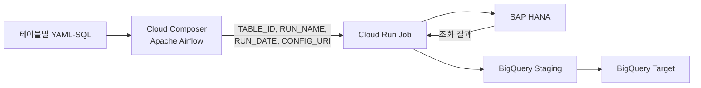
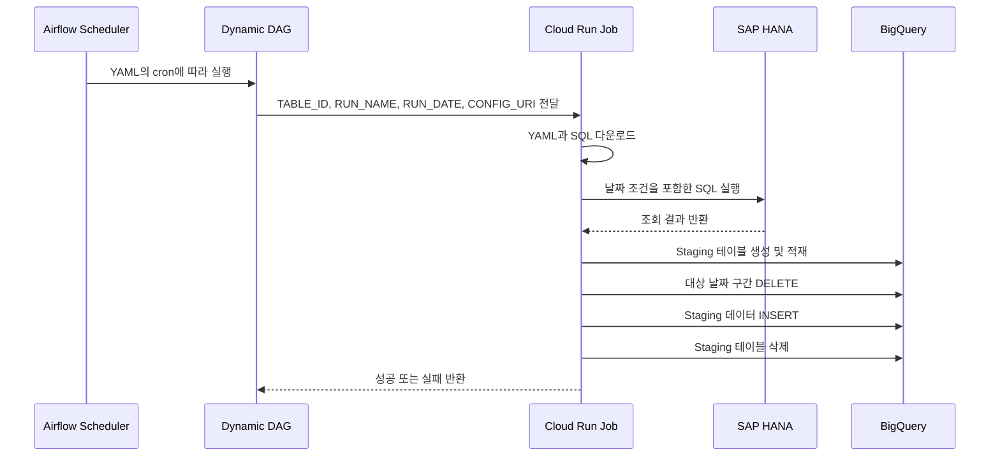

<div align="center">

# SAP HANA → BigQuery  
## Cloud Composer 기반 배치 오케스트레이션

**YAML과 SQL만 추가하면 테이블별 Airflow DAG가 자동 생성되는 데이터 적재 파이프라인**

<p>
  
  
  
  
  
  
</p>

</div>


# Cloud Composer(Apache Airflow) 기반 SAP HANA → BigQuery 배치 오케스트레이션

SAP HANA 데이터를 BigQuery에 정기 적재하기 위해 구축한


**Cloud Composer(Apache Airflow) 기반 설정 중심 배치 오케스트레이션 프로젝트**입니다.

기존에는 테이블이 추가될 때마다 새로운 배치 코드와 Cloud Run Job을 만들어야 했습니다.  
이를 공통 로더와 동적 DAG 구조로 개선하여,


사용자가 **YAML 설정과 SQL 파일만 추가하면 새로운 적재 작업이 자동 생성**되도록 구성했습니다.


## 구현 결과

- 하나의 Cloud Run Job으로 여러 HANA 테이블을 처리하는 공통 로더 구현
- 테이블별 YAML 설정을 읽어 Airflow DAG를 자동 생성
- 테이블마다 서로 다른 일별·월별 스케줄과 조회 기간 설정
- 신규 테이블 등록 과정을 YAML과 SQL 업로드로 표준화

구축 과정과 기술적 의사결정은 [구축 과정 문서](docs/implementation.md)에서 확인할 수 있습니다.

----------------------------

## 아키텍처



### 실행 흐름 



세부 실행 흐름은 [상세 아키텍처 문서](docs/architecture.md)에서 확인할 수 있습니다.

----------------------------

## 코드 수정 없이 테이블 확장

테이블마다 달라지는 내용을 코드가 아닌 YAML과 SQL로 분리했습니다.

```text
dags/
├─ hana_bq_dag.py
└─ hana_bq/
   ├─ configs/
   │  ├─ TABLE_A.yaml
   │  └─ TABLE_B.yaml
   └─ queries/
      ├─ TABLE_A.sql
      └─ TABLE_B.sql
```

신규 테이블을 추가할 때는 다음 두 파일만 등록합니다.

```text
configs/새로운테이블.yaml
queries/새로운테이블.sql
```

공통 로더, Docker 이미지, Cloud Run Job과 DAG 코드는 수정하지 않습니다.

파일 작성과 등록 방법은 [신규 테이블 등록 가이드](docs/table-onboarding.md)에서 확인할 수 있습니다.

----------------------------

## 데이터 적재 안정성

Cloud Run 공통 로더는 다음 순서로 데이터를 처리합니다.

1. BigQuery Staging 테이블 생성
2. HANA 데이터를 Chunk 단위로 조회
3. Staging 테이블 적재
4. 적재 건수 검증
5. 기존 날짜 구간 삭제
6. 신규 데이터 삽입
7. 성공 시 Staging 테이블 삭제

HANA 조회 또는 Staging 적재 중 오류가 발생하면 Target 테이블을 변경하지 않습니다.

실패한 Staging 테이블은 원인 확인을 위해 남기고, 설정된 만료 시간이 지나면 자동 삭제되도록 구성했습니다.

오류 확인 방법은 [운영 및 장애 대응 문서](docs/troubleshooting.md)에서 확인할 수 있습니다.

-------------------------------

## 기술 스택

<p>
  
  
  
  
  
  
</p>

<p>
  
  
  
  
  
</p>


## 프로젝트 문서

- [상세 아키텍처](docs/architecture.md)
- [구축 과정과 기술적 의사결정](docs/implementation.md)
- [신규 테이블 등록 가이드](docs/table-onboarding.md)
- [운영 및 장애 대응](docs/troubleshooting.md)
