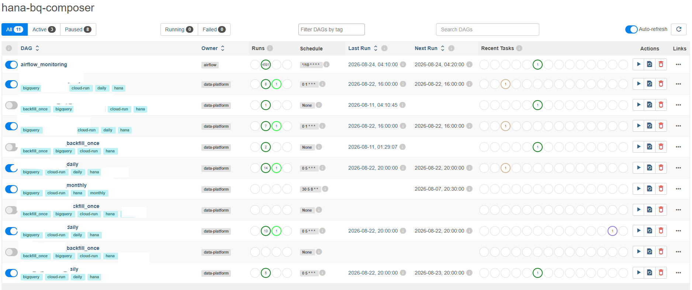
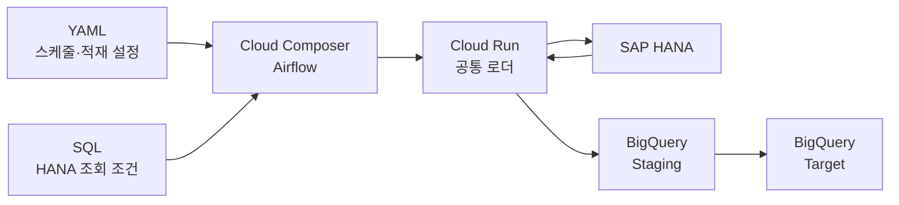
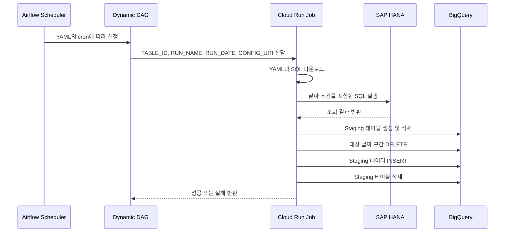

<div align="center">

# SAP HANA → BigQuery 
# Cloud Composer(Apache Airflow) 기반 배치 오케스트레이션


**YAML과 SQL만 추가하면 테이블별 Airflow DAG가 자동 생성되는 데이터 적재 파이프라인**

<p>
  
  
  
  
  
  
</p>

> 본 파이프라인은 [Business Data & AI Dashboard](https://github.com/qkrwlfjddl/Business-Data-AI-Dashboard)에서 사용하는 데이터를 통합·적재하는 역할을 합니다.

<sub> 🔐 실제 업무 데이터와 소스 코드는 보안상 공개하지 않습니다.
공개 가능한 범위에서 시스템 구조, 데이터 흐름, 분석 로직 및 구현 내용을 정리했습니다.</sub>
</div>

---
## 구현 결과



| ♻️ 공통 로더 | ⚙️ 동적 DAG |
|:---:|:---:|
| **하나의 Cloud Run Job**으로<br/>여러 HANA 테이블 처리 | 테이블별 YAML을 읽어<br/>**Airflow DAG 자동 생성** |

| 🕒 독립 스케줄 | 📁 간편한 테이블 확장 |
|:---:|:---:|
| 테이블마다 서로 다른<br/>일별·월별 실행 시간 설정 | **YAML 1개 + SQL 1개**만<br/>업로드하여 신규 테이블 등록 |

> **신규 테이블 추가 = YAML 1개 + SQL 1개**  
> 코드 수정이나 컨테이너 재빌드 없이 새로운 적재 작업을 추가할 수 있습니다.

구축 과정과 기술적 의사결정은 [구축 과정 문서](docs/implementation.md)에서 확인할 수 있습니다.

----------------------------
## 한눈에 보기

### 파일 구조

```text
hana-bq/
├── dags/
│   ├── hana_bq_dag.py
│   └── hana_bq/
│       ├── configs/
│       └── queries/
├── loader/
│   ├── main.py
│   ├── Dockerfile
│   └── requirements.txt
└── README.md
```

### 아키텍처



### 실행 흐름 



<details>
<summary><strong>Airflow가 담당하는 역할 확인하기</strong></summary>

- 테이블별 실행 일정 관리
- Cloud Run Job 실행
- 실패 작업 재시도
- 동시 실행 제한
- 실행 상태 및 이력 관리

실제 데이터 조회와 적재는 Python 기반 Cloud Run Job이 담당합니다.

</details>

세부 실행 흐름은 [상세 아키텍처 문서](docs/architecture.md)에서 확인할 수 있습니다.

----------------------------

## 데이터 적재 안정성

Cloud Run 공통 로더는 다음 순서로 데이터를 처리합니다.

1. BigQuery Staging 테이블 생성
2. HANA 데이터를 Chunk 단위로 조회
3. Staging 테이블 적재
4. 적재 건수 검증
5. 기존 날짜 구간 삭제
6. 신규 데이터 삽입
7. 성공 시 Staging 테이블 삭제

관련문서 [운영 및 장애 대응 문서](docs/troubleshooting.md)에서 확인할 수 있습니다.

-------------------------------
## 프로젝트 문서

| 문서 | 내용 |
|---|---|
| [아키텍처](docs/architecture.md) | 서비스 구성과 전체 실행 흐름 |
| [구축 과정](docs/implementation.md) | 구현 순서와 기술적 의사결정 |
| [테이블 등록 가이드](docs/table-onboarding.md) | YAML·SQL 작성 및 업로드 방법 |
| [오류 대응](docs/troubleshooting.md) | 주요 오류의 원인과 해결 방법 |
