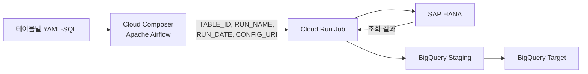

# HANA-BQ-CloudComposer

SAP HANA 데이터를 BigQuery에 정기 적재하기 위해 구축한  
**Cloud Composer(Apache Airflow) 기반 설정 중심 배치 오케스트레이션 프로젝트**입니다.

기존에는 테이블이 추가될 때마다 새로운 배치 코드와 Cloud Run Job을 만들어야 했습니다.  
이를 공통 로더와 동적 DAG 구조로 개선하여, 사용자가 **YAML 설정과 SQL 파일만 추가하면 새로운 적재 작업이 자동 생성**되도록 구성했습니다.

## 핵심 성과

- SAP HANA → BigQuery 공통 적재 로더 개발
- Cloud Run Job 기반 컨테이너 실행 환경 구성
- Cloud Composer 기반 일별·월별 배치 오케스트레이션
- 테이블별 독립 스케줄 및 조회 기간 설정
- YAML 기반 Airflow DAG 자동 생성
- 실패 재시도, 동시 실행 제한 및 작업 상태 관리
- BigQuery Staging 테이블을 활용한 안전한 구간 교체
- 신규 테이블 추가 절차를 YAML과 SQL 업로드로 표준화

## 아키텍처



Airflow는 데이터를 직접 전송하지 않고 다음 작업을 담당합니다.

- 테이블별 실행 일정 관리
- Cloud Run Job 실행
- 실행 상태 확인
- 실패 작업 재시도
- 동시 실행 제어
- 일별·월별 작업 분리

실제 HANA 조회와 BigQuery 적재는 Python 기반 Cloud Run Job이 담당합니다.

## 설정 중심 확장 구조

운영 파일은 Composer 버킷에서 다음과 같이 관리합니다.

```text
dags/
├─ hana_bq_dag.py
└─ hana_bq/
   ├─ configs/
   │  ├─ TABLE_A.yaml
   │  └─ TABLE_B.yaml
   └─ queries/
      ├─ TABLE_A.sql
      └─ TABLE_B.sql
```

신규 테이블을 추가할 때는 다음 두 파일만 등록합니다.

```text
configs/새로운테이블.yaml
queries/새로운테이블.sql
```

공통 로더, Docker 이미지, Cloud Run Job과 DAG 코드는 수정하지 않습니다.

## 지원하는 실행 방식

### 일별 재조회

```yaml
window:
  type: rolling_days
  days: 2
```

실행일을 포함한 최근 2일 데이터를 다시 조회하고 BigQuery의 동일한 날짜 구간을 교체합니다.

### 전월 재조회

```yaml
window:
  type: previous_month
```

매월 지정한 날짜에 전월 전체 데이터를 다시 조회합니다.

### 테이블별 스케줄

```yaml
schedule: "0 5 * * *"    # 매일 오전 5시
schedule: "0 6 10 * *"   # 매월 10일 오전 6시
```

모든 스케줄은 `Asia/Seoul` 기준으로 처리됩니다.

## 데이터 적재 안정성

Cloud Run 공통 로더는 다음 순서로 데이터를 처리합니다.

1. 임시 Staging 테이블 생성
2. HANA 데이터를 Chunk 단위로 조회
3. BigQuery Staging 테이블에 적재
4. 적재 건수 검증
5. 기존 날짜 구간 삭제
6. 신규 데이터 삽입
7. 성공 시 Staging 테이블 삭제

적재 도중 실패하면 기존 Target 테이블은 유지되고, Staging 테이블은 디버깅을 위해 일정 시간 보존됩니다.

## 프로젝트 문서

- [상세 아키텍처](docs/architecture.md)
- [구축 과정과 기술적 의사결정](docs/implementation.md)
- [신규 테이블 등록 가이드](docs/table-onboarding.md)
- [운영 및 장애 대응](docs/troubleshooting.md)

## 기술 스택

| 구분 | 기술 |
|---|---|
| Orchestration | Apache Airflow, Cloud Composer |
| Runtime | Cloud Run Jobs, Docker |
| Source | SAP HANA, `hdbcli` |
| Destination | BigQuery |
| Configuration | YAML |
| Language | Python |
| Storage | Cloud Storage |
| Security | Secret Manager, IAM |
| Network | VPC Egress |
| Version Control | Git, GitHub |

## 보안
민감 정보는 코드에 저장하지 않고 실행 환경의 Secret Manager와 환경변수를 통해 주입합니다.
