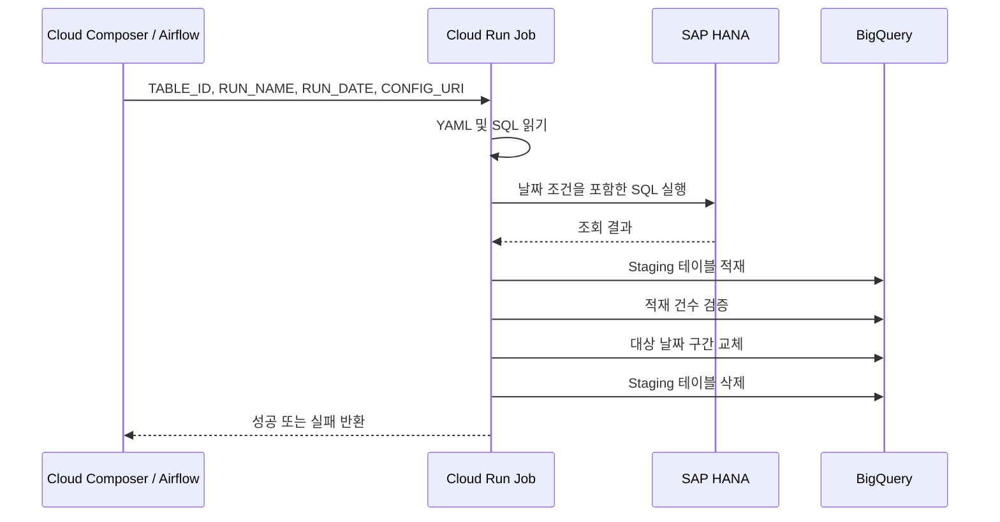
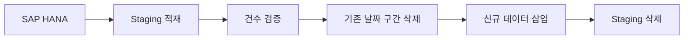

# 시스템 아키텍처

> Cloud Composer가 테이블별 스케줄과 실행 상태를 관리하고,  
> Cloud Run 공통 로더가 SAP HANA 조회와 BigQuery 적재를 수행합니다.

[← 메인 README로 돌아가기](../README.md)

## 전체 실행 흐름



<br>

## 구성요소별 역할

| 구성요소 | 역할 |
|---|---|
| Cloud Composer / Airflow | 스케줄, 재시도, 동시 실행 및 작업 상태 관리 |
| Cloud Run Job | HANA 조회, 데이터 검증 및 BigQuery 적재 |
| Cloud Storage | DAG, 테이블별 YAML과 SQL 저장 |
| SAP HANA | 원천 데이터 제공 |
| BigQuery | Staging 및 최종 Target 데이터 저장 |
| Secret Manager / VPC | 접속 정보 보호 및 HANA 네트워크 연결 |

Airflow에는 데이터 처리 로직을 넣지 않고, 실제 데이터 처리는 Cloud Run Job에 위임했습니다.


<br>

## 동적 DAG 생성

`hana_bq_dag.py`는 다음 폴더의 YAML을 읽습니다.

```text
dags/hana_bq/configs/*.yaml
```

YAML에 정의된 `runs`마다 하나의 DAG가 생성됩니다.

```yaml
runs:
- name: daily
  schedule: "0 5 * * *"

- name: monthly
  schedule: "0 6 10 * *"
```

생성되는 DAG:

```text
hana_bq_테이블명_daily
hana_bq_테이블명_monthly
```

월별 설정이 없는 테이블은 daily DAG만 생성됩니다.


<br>

## BigQuery 적재 방식



HANA 조회와 Staging 적재가 성공한 후에만 Target 데이터를 변경합니다.

실패한 Staging 테이블에는 만료 시간을 설정하여 원인 확인 후 자동 삭제되도록 구성했습니다.


<br>

## 실행 제어

각 DAG에는 다음 정책을 적용했습니다.

```python
retries = 2
retry_delay = 10분
max_active_runs = 1
pool = "hana_extract_pool"
```
retries=2 - 일시적인 오류 자동 재시도 
retry_delay=10분 - 재시도 전 복구 시간 확보 
max_active_runs=1 - 동일 DAG 중복 실행 방지
hana_extract_pool - HANA 동시 접속 제한 
Deferrable Operator - Cloud Run 대기 중 Worker 점유 최소화 
