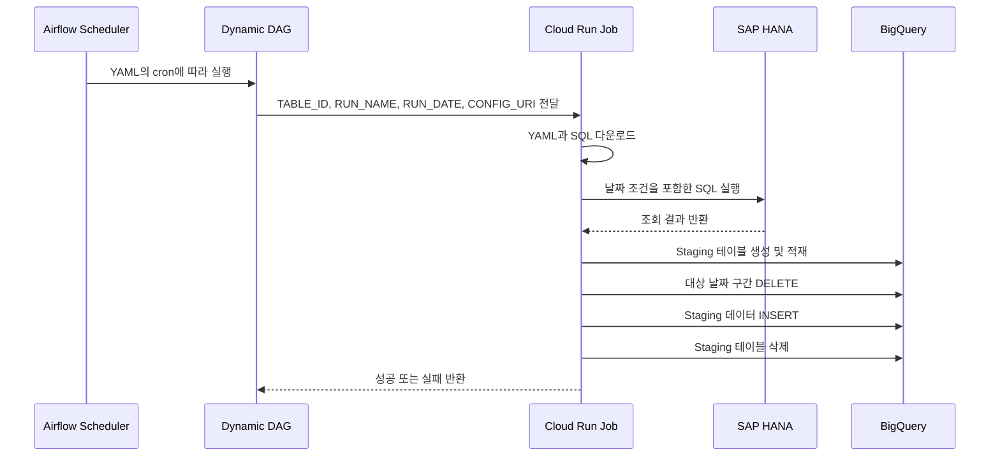

# 아키텍처

## 설계 목적

이 프로젝트의 목적은 SAP HANA 테이블이 추가될 때마다 별도의 배치 프로그램과 Cloud Run Job을 생성해야 하는 문제를 해결하는 것입니다.

하나의 공통 로더와 하나의 DAG Factory를 사용하고, 테이블별 차이는 YAML과 SQL로 분리했습니다.

```text
공통 영역
├─ Python 적재 로직
├─ Docker 이미지
├─ Cloud Run Job
└─ Airflow DAG Factory

테이블별 영역
├─ YAML 설정
└─ SQL
```

## 구성요소별 역할

| 구성요소 | 역할 |
|---|---|
| Cloud Composer | Airflow 환경 운영 |
| Airflow DAG | 스케줄, 재시도 및 실행 상태 관리 |
| Cloud Run Job | HANA 조회 및 BigQuery 적재 |
| Cloud Storage | DAG, YAML, SQL 저장 |
| Secret Manager | HANA 접속 정보 관리 |
| VPC | Cloud Run과 HANA 네트워크 연결 |
| BigQuery | 최종 데이터 및 Staging 테이블 저장 |

## 실행 흐름



## Airflow와 Cloud Run의 역할 분리

Airflow는 데이터 이동 프로그램이 아니라 오케스트레이션 도구로 사용했습니다.

Airflow의 역할:

- cron 스케줄 관리
- 테이블별 DAG 생성
- Cloud Run Job 실행
- 재시도 및 실패 상태 관리
- 동시 실행 제한
- 실행 이력 제공

Cloud Run의 역할:

- HANA 연결
- SQL 실행
- 데이터 Chunk 조회
- BigQuery 적재
- 건수 검증
- 날짜 구간 교체

이렇게 역할을 분리하여 Airflow DAG에 데이터 처리 로직이 집중되지 않도록 구성했습니다.

## 동적 DAG 생성

`hana_bq_dag.py`는 다음 폴더의 YAML을 읽습니다.

```text
dags/hana_bq/configs/*.yaml
```

YAML에 정의된 `runs`마다 하나의 DAG가 생성됩니다.

```yaml
runs:
- name: daily
  schedule: "0 5 * * *"

- name: monthly
  schedule: "0 6 10 * *"
```

생성되는 DAG:

```text
hana_bq_테이블명_daily
hana_bq_테이블명_monthly
```

월별 설정이 없는 테이블은 daily DAG만 생성됩니다.

## 날짜 구간 계산

### `rolling_days`

```yaml
window:
  type: rolling_days
  days: 4
```

실행 기준일이 `2026-07-24`라면 다음 범위를 조회합니다.

```text
20260721 <= 날짜 컬럼 < 20260725
```

실행일을 포함한 최근 4일을 다시 조회합니다.

### `previous_month`

실행 기준일이 `2026-08-10`이면 다음 범위를 조회합니다.

```text
20260701 <= 날짜 컬럼 < 20260801
```

## BigQuery 구간 교체

PK가 없는 테이블에서도 변경 데이터를 반영할 수 있도록 날짜 구간을 기준으로 데이터를 교체합니다.

```sql
BEGIN TRANSACTION;

DELETE FROM target
WHERE date_column >= start_date
  AND date_column < end_date;

INSERT INTO target
SELECT *
FROM staging;

COMMIT TRANSACTION;
```

HANA 조회 및 Staging 적재가 성공한 뒤에만 Target 변경을 수행합니다.

## 실행 제어

각 DAG에는 다음 정책을 적용했습니다.

```python
retries = 2
retry_delay = 10분
max_active_runs = 1
pool = "hana_extract_pool"
```

이를 통해 동일 테이블의 중복 실행과 HANA에 대한 과도한 동시 접속을 제한합니다.
 흠 그리고 이거는 이렇게 쓰면 됨? 내용 이게 맞아? 만약에 여기에 들어가야하는 거였으면 implome에서 빼서 여기에 추가해도 됨.. 그리고 이것도 마찬가지로 지금 너무 징그러움 근데 얘는 구조 니까 꾸밀 필요는 ㄴ없을 듯 그냥 간단하게 길이만 줄이면 될 것 같기도해 너의 생각음?
