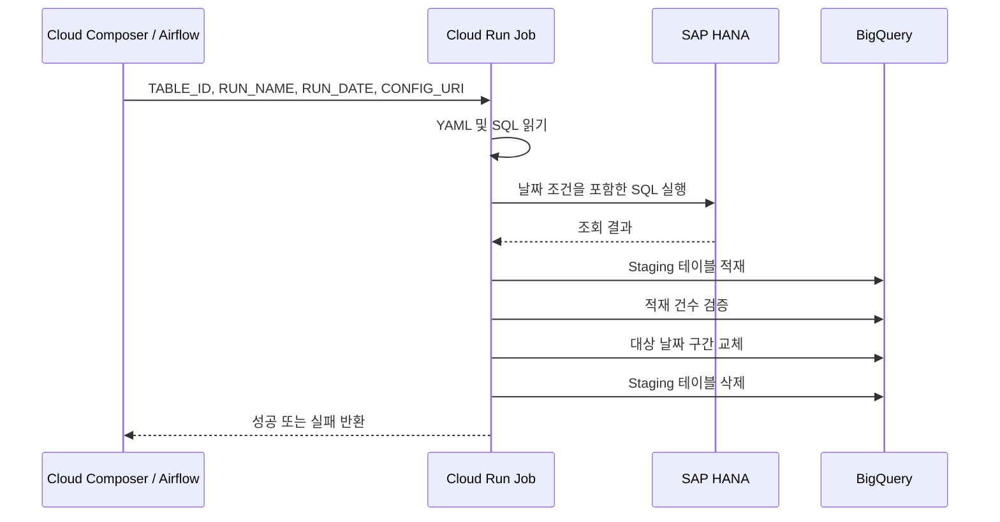
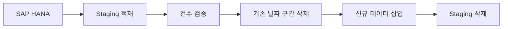

# 시스템 아키텍처

> Cloud Composer가 테이블별 스케줄과 실행 상태를 관리하고,  
> Cloud Run 공통 로더가 SAP HANA 조회와 BigQuery 적재를 수행합니다.

[← 메인 README로 돌아가기](../README.md)

## 전체 실행 흐름



## 구성요소별 역할

| 구성요소 | 역할 |
|---|---|
| Cloud Composer / Airflow | 스케줄, 재시도, 동시 실행 및 작업 상태 관리 |
| Cloud Run Job | HANA 조회, 데이터 검증 및 BigQuery 적재 |
| Cloud Storage | DAG, 테이블별 YAML과 SQL 저장 |
| SAP HANA | 원천 데이터 제공 |
| BigQuery | Staging 및 최종 Target 데이터 저장 |
| Secret Manager / VPC | 접속 정보 보호 및 HANA 네트워크 연결 |

Airflow에는 데이터 처리 로직을 넣지 않고, 실제 데이터 처리는 Cloud Run Job에 위임했습니다.

## 동적 DAG 생성

`hana_bq_dag.py`가 다음 경로의 YAML을 읽습니다.

```text
dags/hana_bq/configs/*.yaml
```

YAML의 각 `run` 설정은 하나의 독립된 DAG로 생성됩니다.

```yaml
runs:
  - name: daily
    schedule: "0 5 * * *"

  - name: monthly
    schedule: "0 6 10 * *"
```

```text
daily   → hana_bq_테이블명_daily
monthly → hana_bq_테이블명_monthly
```

월별 설정이 없으면 daily DAG만 생성됩니다. 모든 스케줄은 `Asia/Seoul` 기준입니다.

## 데이터 조회 범위

| 설정 | 동작 |
|---|---|
| `rolling_days` | 실행일을 포함한 최근 N일 재조회 |
| `previous_month` | 전월 전체 재조회 |

실행일이 `2026-07-24`이고 `days: 4`인 경우:

```text
20260721 <= 날짜 컬럼 < 20260725
```

## BigQuery 적재 방식



HANA 조회와 Staging 적재가 성공한 후에만 Target 데이터를 변경합니다.

실패한 Staging 테이블에는 만료 시간을 설정하여 원인 확인 후 자동 삭제되도록 구성했습니다.

## 실행 제어

| 설정 | 목적 |
|---|---|
| `retries=2` | 일시적인 오류 자동 재시도 |
| `retry_delay=10분` | 재시도 전 복구 시간 확보 |
| `max_active_runs=1` | 동일 DAG 중복 실행 방지 |
| `hana_extract_pool` | HANA 동시 접속 제한 |
| Deferrable Operator | Cloud Run 대기 중 Worker 점유 최소화 |

---

[구축 과정과 기술적 의사결정 보기](implementation.md)
