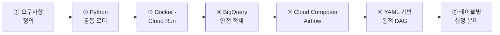
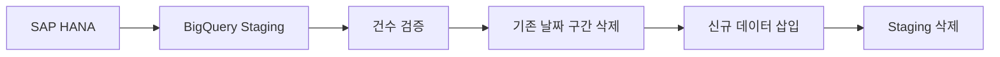
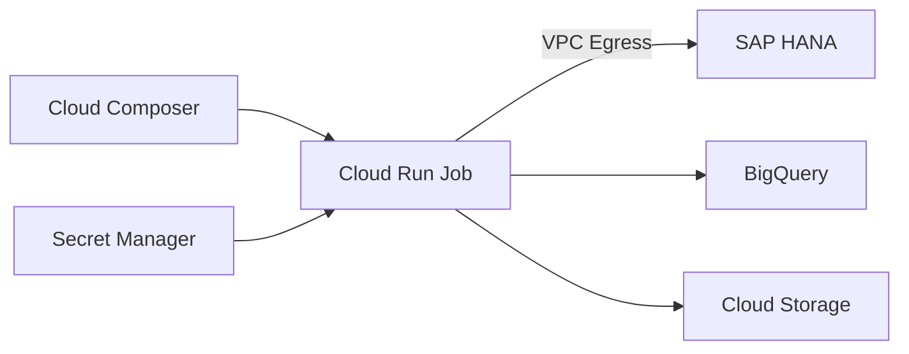

# 구축 과정과 기술적 의사결정

> 테이블마다 배치 코드를 만드는 구조를  
> **하나의 공통 로더와 YAML 기반 동적 DAG 구조**로 개선했습니다.

[← 메인 README로 돌아가기](../README.md)

---

## 핵심 변화

| ♻️ 공통 로더 | 🗓️ 동적 오케스트레이션 | 📁 설정 기반 운영 |
|:---:|:---:|:---:|
| 테이블별 코드·Job 생성 | 신규 테이블마다 DAG 수정 | 설정 변경 시 이미지 재빌드 |
| ↓ | ↓ | ↓ |
| **하나의 Cloud Run Job 재사용** | **YAML 기반 DAG 자동 생성** | **YAML·SQL 업로드만으로 반영** |

<br/>

> **테이블 추가 방식**  
> Python 코드 작성 + Docker 빌드 + Job 생성 + DAG 수정
> ⬇️  
> YAML 1개 + SQL 1개 업로드

## 구축 과정



## 핵심 의사결정

### ♻️ 1. 테이블별 Job 대신 공통 로더

**문제**

테이블이 늘어날 때마다 Python 코드 복사, 이미지 빌드, Cloud Run Job 생성과 DAG 수정이 반복됐습니다.

**선택**

하나의 `main.py`가 실행 정보를 환경변수로 전달받아 여러 테이블을 처리하도록 구현했습니다.

```text
TABLE_ID · RUN_NAME · RUN_DATE · CONFIG_URI
```

**결과**

새로운 테이블을 추가해도 로더 코드와 Cloud Run Job을 만들 필요가 없어졌습니다.

---

### ⚙️ 2. 코드가 아닌 YAML로 실행 방식 관리

테이블마다 달라지는 설정을 YAML과 SQL로 분리했습니다.

```yaml
id: TABLE_A
schedule: "0 5 * * *"
window:
  type: rolling_days
  days: 2
```

YAML에서 관리하는 항목:

```text
실행 시간 · 조회 기간 · BigQuery 대상
날짜 컬럼 · 적재 방식 · 빈 데이터 처리 정책
```

설정 변경을 위해 Python 코드를 수정하거나 Docker 이미지를 다시 빌드하지 않아도 됩니다.

---

### 🗓️ 3. 하나의 DAG가 아닌 실행별 독립 DAG

초기에는 하나의 `hana_bq_daily` DAG 안에 여러 테이블 Task를 생성했습니다.

```text
hana_bq_daily
├─ TABLE_A
└─ TABLE_B
```

하지만 Airflow 스케줄은 Task가 아니라 **DAG 단위**로 적용되기 때문에 테이블별 실행 시간을 다르게 지정할 수 없었습니다.

이를 YAML의 각 실행 설정마다 별도 DAG를 생성하는 방식으로 변경했습니다.

```text
hana_bq_table_a_daily
hana_bq_table_a_monthly
hana_bq_table_b_daily
```

그 결과 각 테이블이 독립적인 스케줄, 실행 이력과 실패 상태를 가질 수 있게 됐습니다.

---

### 🛡️ 4. Target 직접 적재 대신 Staging 적용

HANA 조회 결과를 BigQuery Target 테이블에 바로 쓰지 않고 Staging 테이블을 거치도록 설계했습니다.



HANA 조회 또는 Staging 적재 단계에서 오류가 발생하면 기존 Target 데이터는 변경하지 않습니다.

실패한 Staging 테이블에는 만료 시간을 설정하여 디버깅 후 자동 삭제되도록 했습니다.

--------------------------------
<br>

## Airflow 오케스트레이션

Cloud Composer와 Airflow에는 다음 실행 정책을 적용했습니다.

| 설정 | 목적 |
|---|---|
| `retries=2` | 일시적 오류 자동 재시도 |
| `retry_delay=10분` | HANA 및 네트워크 복구 대기 |
| `max_active_runs=1` | 동일 테이블 중복 실행 방지 |
| `hana_extract_pool` | HANA 동시 접속 수 제한 |
| `Asia/Seoul` | 업무 시간 기준 스케줄 적용 |
| Deferrable Operator | Cloud Run 대기 중 Worker 점유 최소화 |

Airflow는 스케줄과 상태를 관리하고, 실제 데이터 처리는 Cloud Run Job에 위임했습니다.

## 실행 환경



- HANA 접속 정보: 환경변수와 Secret Manager
- HANA 네트워크: VPC 및 Subnet
- 설정 파일: Composer Cloud Storage
- 적재 대상: BigQuery
- 실행 코드: Docker 기반 Cloud Run Job

## 최종 사용자 경험

최종 사용자는 다음 두 파일만 작성합니다.

```text
configs/테이블명.yaml
queries/테이블명.sql
```

Composer 버킷에 업로드하면:

```text
YAML·SQL 업로드
    → Airflow DAG 자동 생성
    → 지정된 시간에 Cloud Run 실행
    → HANA 조회
    → BigQuery 적재
```

> 신규 테이블 추가를 위해 Python, Docker, Cloud Run Job 또는 DAG 코드를 수정할 필요가 없습니다.

---

- [상세 아키텍처 보기](architecture.md)
- [신규 테이블 등록 방법](table-onboarding.md)
- [오류 확인 및 해결 방법](troubleshooting.md)
