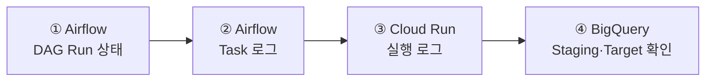

# 운영 및 장애 대응

> 오류 발생 시 **Airflow → Cloud Run → BigQuery** 순서로 상태와 로그를 확인합니다.

[← 메인 README로 돌아가기](../README.md)

---

## 빠른 확인 순서



<br>

| 확인 위치 | 주요 확인 내용 |
|---|---|
| **Airflow DAG Run** | 실행 생성 여부 및 성공·실패 상태 |
| **Airflow Task 로그** | Cloud Run 호출 및 재시도 상태 |
| **Cloud Run 로그** | 설정 경로, 테이블 ID, 조회 범위, 적재 건수 |
| **BigQuery** | Staging 및 Target 데이터 확인 |

---

## 증상별 확인 방법

<details>
<summary><strong> Airflow에 DAG가 나타나지 않음</strong></summary>

<br>

다음 항목을 확인합니다.

- YAML이 `dags/hana_bq/configs/`에 있는지
- YAML 확장자가 `.yaml`인지
- YAML 파일명과 `id`가 동일한지
- `enabled: true`인지
- YAML 들여쓰기가 올바른지
- Airflow에 Broken DAG 오류가 있는지

```text
파일명: TABLE_A.yaml
id: TABLE_A
```

Composer 반영에는 약 1~2분이 걸릴 수 있습니다.

</details>

<br>

<details>
<summary><strong>⏳ 실행 버튼을 눌러도 Cloud Run Job이 실행되지 않음</strong></summary>

<br>

Airflow의 Task 상태를 확인합니다.

| 상태 | 의미 |
|---|---|
| `queued` | Pool 또는 Worker 자리를 기다리는 중 |
| `running` | Task 실행 중 |
| `deferred` | Cloud Run 완료를 비동기로 기다리는 중 |
| `up_for_retry` | 실패 후 재시도 대기 중 |
| `failed` | 재시도 후 최종 실패 |
| `success` | 정상 완료 |

`queued` 상태가 지속되면 `hana_extract_pool`의 사용 가능한 Slot을 확인합니다.

`up_for_retry` 상태라면 재시도 대기 시간인 10분 후 다시 실행됩니다.

</details>

<br>

<details>
<summary><strong> CONFIG_URI 또는 파일 경로 오류</strong></summary>

<br>

대표 오류:

```text
FileNotFoundError: /hana_bq/configs/TABLE_A.yaml
```

`CONFIG_URI`가 로컬 경로가 아닌 전체 GCS 주소인지 확인합니다.

```text
gs://COMPOSER_BUCKET/dags/hana_bq/configs/TABLE_A.yaml
```

SQL 경로는 YAML 위치를 기준으로 작성합니다.

```yaml
query_file: ../queries/TABLE_A.sql
```

</details>

<br>

<details>
<summary><strong> TABLE_ID가 비활성화됨</strong></summary>

<br>

대표 오류:

```text
ValueError: TABLE_ID is disabled
```

YAML의 `enabled` 설정을 확인합니다.

```yaml
enabled: true
```

파일을 다시 업로드한 뒤 Composer 반영을 기다립니다.

</details>

<br>

<details>
<summary><strong> Target과 Staging 스키마가 다름</strong></summary>

<br>

대표 오류:

```text
Target and staging schemas are different
```

HANA SQL의 조회 컬럼과 기존 BigQuery 테이블의 컬럼을 비교합니다.

확인 항목:

- 컬럼 추가 또는 삭제
- 컬럼명 변경
- 컬럼 순서 변경
- 공통 메타데이터 컬럼 누락

스키마 변경은 기존 데이터를 보호하기 위해 자동 적용하지 않습니다. 변경 내용을 검토한 후 BigQuery 스키마를 별도로 반영합니다.

</details>

<br>

<details>
<summary><strong> BigQuery에 Staging 테이블이 남아 있음</strong></summary>

<br>

실패한 실행의 Staging 테이블은 원인 확인을 위해 남을 수 있습니다.

```text
_stg_TABLE_UUID
```

확인할 내용:

- Staging 적재 건수
- Target 스키마와의 차이
- 조회 날짜 범위
- 실패 직전 Cloud Run 로그

Staging 테이블에는 만료 시간이 설정되어 있어 약 1일 후 자동 삭제됩니다.

</details>

<br>

<details>
<summary><strong> HANA 조회 결과가 0건임</strong></summary>

<br>

`allow_empty` 설정에 따라 처리 방식이 달라집니다.

| 설정 | 처리 결과 |
|---|---|
| `allow_empty: true` | 0건도 정상 처리하며 대상 날짜 구간이 비워질 수 있음 |
| `allow_empty: false` | 작업을 실패 처리하고 기존 Target 데이터 유지 |

운영 목적에 따라 값을 신중하게 설정합니다.

</details>

---

## Cloud Run 로그 확인 항목

Cloud Run 로그에서 다음 값을 순서대로 확인합니다.

```text
CONFIG_URI
QUERY_URI
TABLE_ID
RUN_NAME
RUN_DATE
WINDOW
TARGET
STAGING
STAGING_ROWS_LOADED
STATUS
LOADED_ROWS
```

성공 로그 예시:

```text
STATUS=SUCCESS
LOADED_ROWS=100
STAGING_DELETED=project.dataset._stg_TABLE_UUID
```

실패 로그 예시:

```text
STATUS=FAILED, staging retained for debugging
```

---

## 장애 확인 체크리스트

- [ ] Airflow에 DAG Run이 생성되었는가?
- [ ] Task가 `queued` 또는 `up_for_retry` 상태인가?
- [ ] YAML과 SQL 경로가 올바른가?
- [ ] 실행 날짜 범위가 예상과 일치하는가?
- [ ] Staging 테이블에 데이터가 적재되었는가?
- [ ] Target과 Staging 스키마가 일치하는가?
- [ ] BigQuery Target 데이터가 정상 반영되었는가?

---

# 트러블슈팅: account_bsark_mapping 중복 bsark 키로 인한 JOIN fan-out

## 요약

`loader/create_mapping.sql` 로 적재하는 `HANABQ.account_bsark_mapping` 테이블에서
동일한 `bsark` 값이 서로 다른 `account` 이름으로 중복 등록되어 있다.
이 매핑 테이블을 `bsark` 기준으로 JOIN 하면 행이 곱해져(fan-out)
집계 결과(매출/건수 등)가 실제보다 부풀려지는 문제가 발생한다.

## 증상

- BigQuery에서 원천 테이블 ⨝ `account_bsark_mapping` (ON `bsark`) 후
  건수/합계가 원천 대비 커진다.
- 특정 `bsark` (예: `3310`, `3340`, `3080`, `7030`) 관련 계정에서만
  숫자가 어긋난다.
- `account` 라벨이 한 행에 대해 두 가지로 나뉘어 나타난다.

## 원인

`create_mapping.sql` 의 `INSERT ... VALUES` 에 같은 `bsark` 가
2개 이상의 `account` 로 들어가 있다.

| bsark | account 값                       |
| ----- | -------------------------------- |
| 3310  | 자격증 / 해커스자격증            |
| 3340  | 한국사 / 해커스한국사           |
| 3080  | 해커스공기업 / 해커스잡         |
| 7030  | 해커스편입 / 해커스편입인강     |

테이블에 `bsark` 유니크 제약이 없고(BigQuery는 PK/UNIQUE를 강제하지 않음),
매핑을 `LEFT JOIN ... ON t.bsark = m.bsark` 로 사용하면
`bsark = '3310'` 인 원천 1행이 매핑 2행과 매칭되어 2행으로 늘어난다.
그 상태에서 `SUM()` / `COUNT()` 를 하면 값이 2배가 된다.

## 재현

```sql
-- 원천 1행이 매핑 중복으로 2행이 되는지 확인
SELECT bsark, COUNT(*) AS mapping_rows
FROM `ga4-bigquery-431807.HANABQ.account_bsark_mapping`
GROUP BY bsark
HAVING COUNT(*) > 1
ORDER BY bsark;
```

위 쿼리가 행을 반환하면 중복 키가 존재하는 것이다.

## 해결

### 1. 비즈니스 규칙 확정

`bsark` 하나에 `account` 는 하나여야 하는지 먼저 확정한다.
- 하나여야 함 → 대표 account 1개만 남긴다.
- 여러 개가 정상 → 매핑을 1:N 으로 보고, 집계 쿼리에서 fan-out 을 막는다.

### 2-A. bsark 를 1:1 로 정리 (권장)

`create_mapping.sql` 에서 중복 bsark 의 account 를 한 개로 통일한다.
정리 후 적재 직전에 검증 쿼리를 넣어 중복이 다시 들어오면 실패하도록 한다.

```sql
-- 적재 후 무결성 체크: 중복이 있으면 결과가 나오고, 리뷰에서 잡을 수 있음
SELECT bsark, COUNT(*) c
FROM `ga4-bigquery-431807.HANABQ.account_bsark_mapping`
GROUP BY bsark
HAVING c > 1;
```

### 2-B. 매핑을 유지해야 한다면 JOIN 에서 중복 제거

집계 전에 `bsark` 당 대표 account 1건만 선택한다.

```sql
WITH mapping_dedup AS (
  SELECT bsark, ANY_VALUE(account) AS account
  FROM `ga4-bigquery-431807.HANABQ.account_bsark_mapping`
  GROUP BY bsark
)
SELECT ...
FROM source_table AS t
LEFT JOIN mapping_dedup AS m
  ON t.bsark = m.bsark
```

## 예방

- 매핑 적재 파이프라인에 "bsark 유니크" 검증 쿼리를 추가하고,
  중복 발견 시 파이프라인을 실패시킨다.
- 매핑을 JOIN 하는 집계 쿼리는 항상 `bsark` 카디널리티를 가정하고
  1:N 가능성을 코드 리뷰에서 확인한다.

## 참고

- 매핑 정의 파일: `loader/create_mapping.sql`
- 대상 테이블: `ga4-bigquery-431807.HANABQ.account_bsark_mapping`

# 매출성과 대시보드 트러블슈팅 정리

## 문서 범위

이 문서는 현재 `app.py` 구현에 반영된 예외 처리와 방어 로직을 기준으로 정리했다. Git 커밋 이력이 없는 작업 폴더이므로, 아래 내용은 별도의 장애 티켓 기록이 아니라 코드에서 확인되는 문제 상황과 해결 방식이다.

## 1. BigQuery 원본 데이터의 형식 불일치

### 증상

- 연도·월·일·매출 컬럼이 문자열, 빈 값 또는 변환 불가능한 값으로 들어오면 집계 또는 날짜 처리에서 오류가 발생할 수 있다.
- `year`, `month`, `sales` 등 필수 컬럼이 빠진 경우 이후 로직이 잘못된 결과를 만들 수 있다.

### 원인

BigQuery 원본 스키마와 대시보드가 기대하는 분석용 자료형이 항상 일치한다는 보장이 없었다.

### 해결

- 조회 SQL에서 `SAFE_CAST`로 날짜·정수·숫자형을 안전하게 변환했다.
- `normalize_sales_data()`에서 필수 컬럼 존재 여부를 확인하고, 숫자형/날짜형을 다시 정규화했다.
- 필수값으로 사용할 수 없는 행은 집계 전 제외했다.
- `day` 컬럼이 없거나 비어 있으면 1일로 보완했다.

### 재발 방지

- 데이터 소스 변경 시 `year`, `month`, `sales` 컬럼명과 자료형을 먼저 점검한다.
- 새 컬럼을 추가해도 정규화 함수의 입력·출력 계약을 유지한다.

## 2. 기준연도 누적값과 과거 연도 전체값의 혼재

### 증상

- 기준일이 6월인데 기준연도에 하반기 데이터가 포함되면 누적 실적이 과대 집계될 수 있다.
- 반대로 전년 전체 매출과 기준연도 누적 매출을 바로 비교하면 성장률이 왜곡된다.

### 원인

조회 기준일은 기준연도에만 적용되어야 하지만, 연도별 기간 조건을 분리하지 않으면 모든 연도가 같은 방식으로 잘리거나 모두 연간값으로 집계될 수 있다.

### 해결

- `filter_by_base_date()`에서 기준연도는 선택 기준일까지 제한했다.
- 이전 연도는 12월까지의 전체 데이터를 유지했다.
- 기준연도 날짜가 없을 경우에는 `month`와 `day`를 이용한 대체 조건으로 포함 여부를 판단했다.

### 재발 방지

- 기간 집계 변경 시 “기준연도는 누적, 과거 연도는 연간” 규칙이 유지되는지 확인한다.
- 기준일을 월 중간으로 선택하는 테스트도 수행한다.

## 3. 부분 기간 비교에서 성장률 왜곡

### 증상

- 기준연도의 실제 데이터가 있는 월만 비교해야 하는데, 전년도 12개월 전체와 비교하면 반기·전체 행의 성장률이 부정확해진다.

### 원인

기준연도 데이터는 일부 월까지만 존재할 수 있으며, 단순히 연도별 합계를 비교하면 비교 대상 기간이 달라진다.

### 해결

- `_available_current_months()`로 기준연도에 실제 값이 있는 월을 계산했다.
- `build_report()`에서 전년 및 재작년 비교값을 같은 월 집합으로 다시 계산했다.
- KPI도 같은 비교 기간의 전년 실적을 기준으로 산출했다.

### 재발 방지

- 기준연도 데이터가 1~N월까지만 있을 때, 반기·전체 행의 전년 동기 비교가 1~N월 기준인지 검증한다.
- 월별 데이터가 비연속적으로 누락된 경우도 확인한다.

## 4. 결측값과 0으로 인한 계산 오류

### 증상

- 매출 또는 비교 대상이 비어 있으면 합계·증감률이 잘못 0으로 표시되거나 계산 오류가 날 수 있다.
- 이전 실적이 0이면 성장률 계산에서 0으로 나누기가 발생한다.

### 원인

데이터가 없는 상태와 실제 매출이 0인 상태를 구분하지 않으면 지표의 의미가 훼손된다.

### 해결

- `sum_or_na()`가 유효 숫자가 전혀 없을 때 `pd.NA`를 반환하도록 했다.
- `growth_rate()`는 현재값·이전값이 결측이거나 이전값이 0이면 `pd.NA`를 반환하도록 했다.
- KPI 달성률도 KPI가 결측 또는 0일 때 계산하지 않는다.
- 화면에서는 계산 불가 값을 `–`로 표시한다.

### 재발 방지

- 데이터 없음, 이전값 0, 현재값 0, 일부 월 누락 케이스를 지표 테스트에 포함한다.
- 결측값을 임의의 0으로 치환하기 전에는 업무적 의미를 확인한다.

## 5. BigQuery 연결·권한 오류로 화면 사용 불가

### 증상

- Google Cloud 인증 미설정, 프로젝트/테이블 접근 권한 부족, 네트워크 문제 등으로 실데이터 조회가 실패한다.

### 원인

대시보드는 `google.cloud.bigquery.Client`를 통해 외부 BigQuery 테이블을 직접 조회하므로 실행 환경의 인증과 IAM 권한에 의존한다.

### 해결

- 데이터 로딩·필터링·월별 집계를 `try/except`로 감쌌다.
- 사용자에게 실데이터 로드 실패를 안내하고, 오류 상세를 펼쳐서 확인할 수 있게 했다.
- 화면 구조 확인을 위한 데모 데이터 모드를 제공했다.
- 조회 결과는 10분 TTL 캐시로 보관해 반복 조회 부담을 줄였다.

### 재발 방지

- 배포 환경에서 Google Cloud 인증 정보와 대상 테이블 조회 권한을 사전 점검한다.
- `TABLE_NAME` 변경 시 프로젝트·데이터셋·테이블 경로를 함께 검증한다.
- 운영 장애 시 오류 상세의 BigQuery 메시지를 먼저 확인한 뒤 인증, IAM, 테이블 스키마 순으로 점검한다.

## 6. 조회 조건에 해당하는 데이터가 없는 경우

### 증상

- 선택한 기준일과 비교 연도 범위에 데이터가 없을 때 빈 차트·표 또는 후속 처리 오류가 생길 수 있다.

### 해결

- 월별 집계 결과가 비어 있으면 경고를 표시하고 화면 렌더링을 중단한다.

### 재발 방지

- 기준일과 비교 연도 선택 범위를 데이터 보유 기간과 비교한다.
- 신규 연도 데이터 적재 전에는 데모 모드와 실데이터 모드를 구분해 확인한다.

## 점검 순서

문제가 발생하면 다음 순서로 확인한다.

1. 데모 데이터 모드에서 화면이 정상 동작하는지 확인한다.
2. 오류 상세에서 BigQuery 인증·권한·테이블 경로 관련 메시지를 확인한다.
3. 원본 조회 결과의 `year`, `month`, `day`, `sales`, `rdate` 값과 자료형을 확인한다.
4. 선택한 기준일 이후의 기준연도 데이터가 제외되었는지 확인한다.
5. 기준연도 누적월과 전년 동기 비교월이 동일한지 확인한다.

