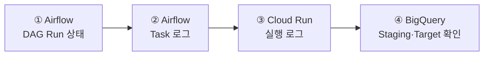

# 운영 및 장애 대응

> 오류 발생 시 **Airflow → Cloud Run → BigQuery** 순서로 상태와 로그를 확인합니다.

[← 메인 README로 돌아가기](../README.md)

---

## 빠른 확인 순서



<br>

| 확인 위치 | 주요 확인 내용 |
|---|---|
| **Airflow DAG Run** | 실행 생성 여부 및 성공·실패 상태 |
| **Airflow Task 로그** | Cloud Run 호출 및 재시도 상태 |
| **Cloud Run 로그** | 설정 경로, 테이블 ID, 조회 범위, 적재 건수 |
| **BigQuery** | Staging 및 Target 데이터 확인 |

---

## 증상별 확인 방법

<details>
<summary><strong> Airflow에 DAG가 나타나지 않음</strong></summary>

<br>

다음 항목을 확인합니다.

- YAML이 `dags/hana_bq/configs/`에 있는지
- YAML 확장자가 `.yaml`인지
- YAML 파일명과 `id`가 동일한지
- `enabled: true`인지
- YAML 들여쓰기가 올바른지
- Airflow에 Broken DAG 오류가 있는지

```text
파일명: TABLE_A.yaml
id: TABLE_A
```

Composer 반영에는 약 1~2분이 걸릴 수 있습니다.

</details>

<br>

<details>
<summary><strong>⏳ 실행 버튼을 눌러도 Cloud Run Job이 실행되지 않음</strong></summary>

<br>

Airflow의 Task 상태를 확인합니다.

| 상태 | 의미 |
|---|---|
| `queued` | Pool 또는 Worker 자리를 기다리는 중 |
| `running` | Task 실행 중 |
| `deferred` | Cloud Run 완료를 비동기로 기다리는 중 |
| `up_for_retry` | 실패 후 재시도 대기 중 |
| `failed` | 재시도 후 최종 실패 |
| `success` | 정상 완료 |

`queued` 상태가 지속되면 `hana_extract_pool`의 사용 가능한 Slot을 확인합니다.

`up_for_retry` 상태라면 재시도 대기 시간인 10분 후 다시 실행됩니다.

</details>

<br>

<details>
<summary><strong> CONFIG_URI 또는 파일 경로 오류</strong></summary>

<br>

대표 오류:

```text
FileNotFoundError: /hana_bq/configs/TABLE_A.yaml
```

`CONFIG_URI`가 로컬 경로가 아닌 전체 GCS 주소인지 확인합니다.

```text
gs://COMPOSER_BUCKET/dags/hana_bq/configs/TABLE_A.yaml
```

SQL 경로는 YAML 위치를 기준으로 작성합니다.

```yaml
query_file: ../queries/TABLE_A.sql
```

</details>

<br>

<details>
<summary><strong> TABLE_ID가 비활성화됨</strong></summary>

<br>

대표 오류:

```text
ValueError: TABLE_ID is disabled
```

YAML의 `enabled` 설정을 확인합니다.

```yaml
enabled: true
```

파일을 다시 업로드한 뒤 Composer 반영을 기다립니다.

</details>

<br>

<details>
<summary><strong> Target과 Staging 스키마가 다름</strong></summary>

<br>

대표 오류:

```text
Target and staging schemas are different
```

HANA SQL의 조회 컬럼과 기존 BigQuery 테이블의 컬럼을 비교합니다.

확인 항목:

- 컬럼 추가 또는 삭제
- 컬럼명 변경
- 컬럼 순서 변경
- 공통 메타데이터 컬럼 누락

스키마 변경은 기존 데이터를 보호하기 위해 자동 적용하지 않습니다. 변경 내용을 검토한 후 BigQuery 스키마를 별도로 반영합니다.

</details>

<br>

<details>
<summary><strong> BigQuery에 Staging 테이블이 남아 있음</strong></summary>

<br>

실패한 실행의 Staging 테이블은 원인 확인을 위해 남을 수 있습니다.

```text
_stg_TABLE_UUID
```

확인할 내용:

- Staging 적재 건수
- Target 스키마와의 차이
- 조회 날짜 범위
- 실패 직전 Cloud Run 로그

Staging 테이블에는 만료 시간이 설정되어 있어 약 1일 후 자동 삭제됩니다.

</details>

<br>

<details>
<summary><strong> HANA 조회 결과가 0건임</strong></summary>

<br>

`allow_empty` 설정에 따라 처리 방식이 달라집니다.

| 설정 | 처리 결과 |
|---|---|
| `allow_empty: true` | 0건도 정상 처리하며 대상 날짜 구간이 비워질 수 있음 |
| `allow_empty: false` | 작업을 실패 처리하고 기존 Target 데이터 유지 |

운영 목적에 따라 값을 신중하게 설정합니다.

</details>

---

## Cloud Run 로그 확인 항목

Cloud Run 로그에서 다음 값을 순서대로 확인합니다.

```text
CONFIG_URI
QUERY_URI
TABLE_ID
RUN_NAME
RUN_DATE
WINDOW
TARGET
STAGING
STAGING_ROWS_LOADED
STATUS
LOADED_ROWS
```

성공 로그 예시:

```text
STATUS=SUCCESS
LOADED_ROWS=100
STAGING_DELETED=project.dataset._stg_TABLE_UUID
```

실패 로그 예시:

```text
STATUS=FAILED, staging retained for debugging
```

---

## 장애 확인 체크리스트

- [ ] Airflow에 DAG Run이 생성되었는가?
- [ ] Task가 `queued` 또는 `up_for_retry` 상태인가?
- [ ] YAML과 SQL 경로가 올바른가?
- [ ] 실행 날짜 범위가 예상과 일치하는가?
- [ ] Staging 테이블에 데이터가 적재되었는가?
- [ ] Target과 Staging 스키마가 일치하는가?
- [ ] BigQuery Target 데이터가 정상 반영되었는가?

---

[시스템 아키텍처 보기 →](architecture.md)
