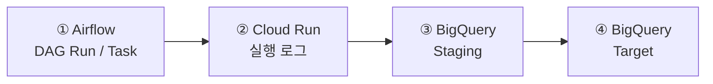

# 트러블 슈팅

> 오류 발생 시 **Airflow → Cloud Run → BigQuery** 순서로 상태와 로그를 확인합니다.
> 파이프라인 실행 상태는 Airflow에서, 실제 처리 원인은 Cloud Run에서, 최종 데이터 반영 여부는 BigQuery에서 확인합니다.

[← 메인 README로 돌아가기](../README.md)

---

## 1. 장애 확인 흐름



| 단계 | 확인 위치                | 주요 확인 내용                   |
| -- | -------------------- | -------------------------- |
| ①  | **Airflow**          | DAG 생성 여부, Task 상태, 재시도 여부 |
| ②  | **Cloud Run**        | 설정 경로, 조회 범위, 실행 결과, 적재 건수 |
| ③  | **BigQuery Staging** | 조회 데이터, 적재 건수, 스키마         |
| ④  | **BigQuery Target**  | 최종 데이터 반영 및 정합성            |

---

## 2. 운영 장애 대응

### 2.1 Airflow에 DAG가 나타나지 않음

**확인 사항**

* YAML이 `dags/hana_bq/configs/`에 존재하는지 확인
* 파일 확장자가 `.yaml`인지 확인
* YAML 파일명과 `id`가 동일한지 확인
* `enabled: true`인지 확인
* YAML 들여쓰기가 올바른지 확인
* Airflow의 Broken DAG 오류 확인

```text
파일명: TABLE_A.yaml
id: TABLE_A
enabled: true
```

설정 파일이 Composer에 반영된 후 DAG가 표시되기까지 일정 시간이 필요할 수 있습니다.

---

### 2.2 Task가 실행되지 않거나 계속 대기함

먼저 Airflow Task 상태를 확인합니다.

| 상태             | 의미          | 확인 사항                 |
| -------------- | ----------- | --------------------- |
| `queued`       | 실행 대기       | Pool Slot 및 Worker 상태 |
| `running`      | 실행 중        | Cloud Run 호출 여부       |
| `deferred`     | 외부 작업 완료 대기 | Cloud Run Job 상태      |
| `up_for_retry` | 재시도 대기      | 이전 실패 원인              |
| `failed`       | 최종 실패       | Task 및 Cloud Run 로그   |
| `success`      | 정상 완료       | BigQuery 반영 여부        |

`queued` 상태가 지속되면 `hana_extract_pool`의 사용 가능한 Slot을 확인합니다.

---

### 2.3 CONFIG_URI 또는 SQL 경로 오류

대표 오류:

```text
FileNotFoundError: /hana_bq/configs/TABLE_A.yaml
```

`CONFIG_URI`는 로컬 경로가 아닌 전체 GCS URI인지 확인합니다.

```text
gs://COMPOSER_BUCKET/dags/hana_bq/configs/TABLE_A.yaml
```

SQL 경로는 YAML 파일 위치를 기준으로 작성합니다.

```yaml
query_file: ../queries/TABLE_A.sql
```

---

### 2.4 TABLE_ID가 비활성화됨

대표 오류:

```text
ValueError: TABLE_ID is disabled
```

해당 YAML의 활성화 여부를 확인합니다.

```yaml
enabled: true
```

설정 변경 후 Composer에 반영되었는지 확인하고 DAG를 다시 실행합니다.

---

### 2.5 Target과 Staging 스키마가 다름

대표 오류:

```text
Target and staging schemas are different
```

다음 항목을 비교합니다.

* 컬럼 추가 또는 삭제
* 컬럼명 변경
* 컬럼 타입 변경
* 컬럼 순서 변경
* 공통 메타데이터 컬럼 누락

스키마 변경은 기존 Target 데이터를 보호하기 위해 자동 적용하지 않습니다.
변경 내용을 검토한 후 BigQuery 스키마를 별도로 반영합니다.

---

### 2.6 BigQuery에 Staging 테이블이 남아 있음

실패한 실행의 Staging 테이블은 원인 분석을 위해 남을 수 있습니다.

```text
_stg_TABLE_UUID
```

다음 순서로 확인합니다.

1. Staging 적재 건수 확인
2. Target과 Staging 스키마 비교
3. 실행 날짜 및 조회 범위 확인
4. 해당 실행의 Cloud Run 로그 확인

Staging 테이블은 만료 정책에 따라 일정 시간이 지나면 자동 삭제됩니다.

---

### 2.7 HANA 조회 결과가 0건임

`allow_empty` 설정에 따라 처리 방식이 달라집니다.

| 설정                   | 처리 결과                       |
| -------------------- | --------------------------- |
| `allow_empty: true`  | 0건을 정상 결과로 처리               |
| `allow_empty: false` | 작업 실패 처리 및 기존 Target 데이터 유지 |

특히 기존 데이터를 삭제한 후 재적재하는 구간에서는 `allow_empty: true` 설정 시 대상 기간의 데이터가 비워질 수 있으므로 업무 규칙에 맞게 설정합니다.

---

## 3. Cloud Run 로그 확인

Cloud Run에서는 다음 값을 중심으로 확인합니다.

```text
CONFIG_URI
QUERY_URI
TABLE_ID
RUN_NAME
RUN_DATE
WINDOW
TARGET
STAGING
STAGING_ROWS_LOADED
STATUS
LOADED_ROWS
```

### 정상 처리

```text
STATUS=SUCCESS
LOADED_ROWS=100
STAGING_DELETED=project.dataset._stg_TABLE_UUID
```

### 실패 처리

```text
STATUS=FAILED
staging retained for debugging
```

실패한 경우 Cloud Run 로그에서 원인을 확인한 뒤 동일 실행의 Airflow Task와 BigQuery 결과를 함께 확인합니다.

---

# 4. 데이터 정합성 트러블슈팅

## 4.1 `account_bsark_mapping` 중복 키로 인한 JOIN Fan-out

### 증상

* 원천 데이터와 `account_bsark_mapping`을 JOIN한 후 매출 또는 건수가 증가함
* 특정 `bsark`에서만 집계 결과가 비정상적으로 커짐
* 동일한 원천 데이터가 서로 다른 `account`로 중복 표시됨

### 원인

`account_bsark_mapping`에 동일한 `bsark`가 서로 다른 `account` 값으로 중복 등록되어 있었습니다.

| bsark  | account         |
| ------ | --------------- |
| `3310` | 자격증 / 해커스자격증    |
| `3340` | 한국사 / 해커스한국사    |
| `3080` | 해커스공기업 / 해커스잡   |
| `7030` | 해커스편입 / 해커스편입인강 |

예를 들어 원천 데이터에 `bsark = '3310'`인 행이 1개 있고, 매핑 테이블에 동일한 `bsark`가 2개 존재하면 JOIN 결과가 2개 행으로 증가합니다.

이 상태에서 `SUM()` 또는 `COUNT()`를 수행하면 실제 값보다 크게 집계됩니다.

### 재현

```sql
SELECT
    bsark,
    COUNT(*) AS mapping_rows
FROM `ga4-bigquery-431807.HANABQ.account_bsark_mapping`
GROUP BY bsark
HAVING COUNT(*) > 1
ORDER BY bsark;
```

결과가 반환되면 `bsark` 기준 1:1 매핑이 깨진 상태입니다.

### 해결

비즈니스 규칙상 `bsark` 하나에 `account` 하나가 대응해야 한다면 매핑 데이터를 1:1로 정리합니다.

```sql
SELECT
    bsark,
    COUNT(*) AS mapping_rows
FROM `ga4-bigquery-431807.HANABQ.account_bsark_mapping`
GROUP BY bsark
HAVING COUNT(*) > 1;
```

매핑이 업무상 1:N으로 유지되어야 하는 경우에는 JOIN 전에 중복을 제거합니다.

```sql
WITH mapping_dedup AS (
    SELECT
        bsark,
        ANY_VALUE(account) AS account
    FROM `ga4-bigquery-431807.HANABQ.account_bsark_mapping`
    GROUP BY bsark
)

SELECT ...
FROM source_table AS t
LEFT JOIN mapping_dedup AS m
    ON t.bsark = m.bsark;
```

### 재발 방지

* 매핑 적재 후 `bsark` 중복 검증
* 중복 발견 시 적재 또는 검증 단계 실패 처리
* 매핑 JOIN 전 키의 카디널리티 확인
* `SUM()` / `COUNT()` 수행 전 JOIN으로 인한 행 증가 여부 검증

> 관련 파일: `loader/create_mapping.sql`

---

# 5. 매출성과 대시보드 트러블슈팅

## 5.1 BigQuery 원본 데이터 형식 불일치

### 증상

* `year`, `month`, `day`, `sales`에 문자열이나 빈 값이 존재
* 날짜 또는 매출 집계 과정에서 오류 발생
* 필수 컬럼 누락으로 후속 집계가 정상적으로 수행되지 않음

### 해결

* 조회 SQL에서 `SAFE_CAST`를 사용해 자료형을 안전하게 변환
* `normalize_sales_data()`에서 필수 컬럼 존재 여부 확인
* 숫자형 및 날짜형 데이터 재정규화
* 집계에 사용할 수 없는 행은 집계 전에 제외

### 재발 방지

원본 데이터 변경 시 다음 컬럼의 이름과 자료형을 먼저 확인합니다.

```text
year
month
day
sales
rdate
```

---

## 5.2 기준연도 누적값과 과거 연도 전체값 혼재

### 증상

기준일이 6월인데 기준연도에 7~12월 데이터까지 포함되면 누적 실적이 과대 집계될 수 있습니다.

### 원인

기준연도와 이전 연도에 동일한 기간 조건을 적용하면 누적 실적과 연간 실적의 비교 기준이 달라집니다.

### 해결

`filter_by_base_date()`에서 기간 조건을 분리합니다.

* 기준연도 → 선택한 기준일까지 집계
* 이전 연도 → 비교 목적에 맞는 전체 또는 동일 기간 데이터 사용

### 재발 방지

기준일이 월 중간인 경우에도 기준연도 누적 기준이 정상적으로 적용되는지 확인합니다.

---

## 5.3 부분 기간 비교로 인한 성장률 왜곡

### 증상

기준연도는 1~6월까지만 존재하는데 전년도 1~12월 전체와 비교하면 성장률이 왜곡됩니다.

### 해결

`_available_current_months()`를 이용해 기준연도에 실제 데이터가 존재하는 월을 계산합니다.

이후 전년 및 재작년 비교값도 동일한 월 집합으로 계산합니다.

```text
기준연도: 1~6월
전년도:   1~6월
재작년:   1~6월
```

KPI 역시 동일한 비교 기간을 적용합니다.

---

## 5.4 결측값과 0으로 인한 계산 오류

### 증상

* 데이터가 없는 값이 0으로 표시됨
* 이전 값이 0일 때 성장률 계산 오류 발생
* 결측 데이터를 실제 실적으로 잘못 해석할 수 있음

### 해결

* `sum_or_na()` → 유효한 숫자가 없으면 `pd.NA`
* `growth_rate()` → 비교값이 결측이거나 0이면 성장률 계산하지 않음
* KPI가 결측 또는 0이면 달성률 계산하지 않음
* 화면에서는 계산 불가 값을 `–`로 표시

### 재발 방지

다음 케이스를 구분하여 테스트합니다.

```text
데이터 없음
현재값 = 0
이전값 = 0
일부 월 누락
```

---

## 5.5 BigQuery 연결 및 권한 오류

### 증상

* Google Cloud 인증 실패
* BigQuery 테이블 접근 권한 부족
* 프로젝트 또는 테이블 경로 오류
* 실행 환경에서 데이터 조회 실패

### 해결

* 데이터 로딩 및 집계 과정에 예외 처리
* 사용자에게 데이터 조회 실패 상태 안내
* 오류 상세 확인 기능 제공
* 화면 구조 확인을 위한 데모 데이터 모드 제공
* 조회 결과를 TTL 캐시하여 반복 조회 부담 완화

### 재발 방지

배포 전 다음 항목을 확인합니다.

* Google Cloud 인증
* BigQuery IAM 권한
* 프로젝트 ID
* Dataset
* Table 경로
* `TABLE_NAME` 설정

---

## 5.6 조회 결과가 없는 경우

### 증상

선택한 기준일 또는 비교 연도에 데이터가 없으면 빈 차트나 후속 처리 오류가 발생할 수 있습니다.

### 해결

월별 집계 결과가 없으면 사용자에게 데이터가 없음을 안내하고 추가 렌더링을 중단합니다.

### 재발 방지

기준일과 비교 연도 범위가 실제 데이터 보유 기간에 포함되는지 확인합니다.

---

# 6. 장애 대응 체크리스트

## Pipeline

* [ ] Airflow에 DAG Run이 생성되었는가?
* [ ] Task가 `queued` 또는 `up_for_retry` 상태인가?
* [ ] Task 로그에 Cloud Run 호출 오류가 있는가?
* [ ] Cloud Run 로그에서 `CONFIG_URI`와 `QUERY_URI`가 정상인가?
* [ ] `TABLE_ID`가 활성화되어 있는가?
* [ ] 실행 날짜와 `WINDOW`가 예상 범위인가?
* [ ] Staging에 데이터가 적재되었는가?
* [ ] Target과 Staging 스키마가 일치하는가?
* [ ] Target 데이터가 정상 반영되었는가?

## Data Quality

* [ ] JOIN 전후 행 수가 증가하지 않았는가?
* [ ] 매핑 키의 중복 여부를 확인했는가?
* [ ] 1:N JOIN으로 인한 fan-out이 없는가?
* [ ] `SUM()` / `COUNT()` 전에 중복 행이 발생하지 않는가?
* [ ] 기준연도와 비교연도의 기간이 동일한가?
* [ ] 결측값과 실제 `0`을 구분하고 있는가?

## Dashboard

* [ ] 원본 필수 컬럼과 자료형이 정상인가?
* [ ] 기준일 이후의 기준연도 데이터가 제외되었는가?
* [ ] 전년 동기 비교 기간이 동일한가?
* [ ] BigQuery 인증과 권한이 정상인가?
* [ ] 조회 결과가 없는 경우가 처리되는가?

---

## 7. 관련 경로

| 대상     | 경로                             |
| ------ | ------------------------------ |
| DAG 설정 | `dags/hana_bq/configs/`        |
| SQL 쿼리 | `dags/hana_bq/queries/`        |
| 매핑 정의  | `loader/create_mapping.sql`    |
| 대시보드   | `app.py`                       |
| 매핑 테이블 | `HANABQ.account_bsark_mapping` |
